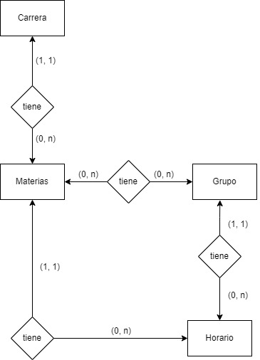
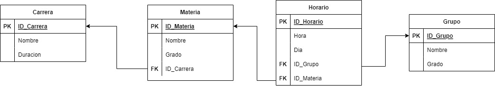

# Reto rest api alumnos

para este reto vamos a crear una api en la que unicamente registraremos una curricula escolar que esta conformada por cuatro tablas: 
 * carrera
 * materias
 * grupo
 * horario

El modelo de base de datos entidad relacional es el siguiente

    

El modelo relacional es el siguiente

    

pueden obtener el código para generar la base de datos en el archivos bd.sql en este reporitorio o en el siguiente fragmento de código

~~~sql
CREATE DATABASE Reto;

USE Reto;

CREATE TABLE Carrera(
    ID_Carrera int NOT NULL AUTO_INCREMENT,
    Nombre varchar(200),
    Duracion int,
    PRIMARY KEY(ID_Carrera)
);

CREATE TABLE Materia(
    ID_Materia int NOT NULL AUTO_INCREMENT,
    Nombre varchar(200),
    Grado int,
    ID_Carrera int,
    PRIMARY KEY(ID_Materia),
    FOREIGN KEY(ID_Carrera) REFERENCES Carrera(ID_Carrera)
);

CREATE TABLE Grupo(
    ID_Grupo int,
    Nombre varchar(200),
    Grado int,
    PRIMARY KEY(ID_Grupo)
);

CREATE TABLE Horario(
    ID_Horario int NOT NULL AUTO_INCREMENT,
    Hora int,
    Dia int,
    ID_Grupo int,
    ID_Materia int,
    PRIMARY KEY(ID_Horario),
    FOREIGN KEY(ID_Grupo) REFERENCES Grupo(ID_Grupo),
    FOREIGN KEY(ID_Materia) REFERENCES Materia(ID_Materia)
);
~~~

en el caso de importar el archivo sql hay que dirigirse al directorio en que esta instalado mariadb y en la carpeta bin utilizando una terminal ejecutar el siguiente comando:

~~~
 $ mysql -u root -p reto > C:/directorio/bd.sql
~~~

de lo contrario solamente hay que copiar y pegar en la consola el código sql mientras estamos en el cliente de mariadb.

Para entrar al cliente de mariadb en la consola hay que igualmente dirigirse al directorio de instalacion de mariadb entonces dirigirse a la carpeta bin y ejecutar el comando mysql -u root -p e ingresar la contarseña del usuario root, misma que se definió en la instalacion de mariadb

~~~
C:\Program Files\MariaDB 10.9\bin> mysql -u root -p
Enter password:
~~~

en este repositorio se encuentra el esqueleto de un api sencilla de express, puedes utilizar este esqueleto o si así los prefieres puedes usar tu propia api de express respetando los directorios routes, config, controller.

en esta api contaremos con los siguientes endpoints:

~~~
POST: /carrera
POST: /materia
POST: /grupo
POST: /Horario
~~~

estos endpoints son para recibir la información y registrarla en la bd. La información se recibe en formato json en el body, el siguiente es el ejemplo de como se recibirán los datos de la tabla materia:

~~~js
{
    "Nombre": "Programacion orientada a objetos",
    "Grado": 2,
    "ID_Carrera": 1
}
~~~

No es necesario enviar el ID de cada elemento ya que estos son autoincrementables y se generarán en cada registro.

Es necesario hacer validaciones para comprobar que al ingresar una llave foranea esta exista antes de ingresar los datos en la bd para que esta no arroje excepciones.

Cuando se registre un dato de manera exitosa el endpoint deberá devolver al cliente una respuesta con formato json con un status 201:

~~~js
{
    "ok": true
}
~~~

para responder en caso algún error es libre, ustedes pueden hacer su propio formato para devolver errores utilizando json.

Y por ultimo solo tendremos un endpoint para obtener informacion de la base de datos que es el siguiente:

~~~
GET /grupo
~~~

este endpoint deberá hacerse una consulta combinando la tabla horario, grupo y materia para obtener el horario de un grupo definido por el cliente.

ejemplo de datos enviados por el cliente:

~~~js
{
    "Grado": 5,
    "Nombre": "B"
}
~~~

ejemplo de datos enviados al cliente
~~~js
[
    {
        "Nombre": "Programacion orientada a objetos", //nombre de la materia
        "Grado": 5,
        "Hora": 7,
        "Dia": 2,
    },
    { 
        "Nombre": "Calculo integral", //nombre de la materia
        "Grado": 5,
        "Hora": 13,
        "Dia": 4,
    }
    
]
~~~